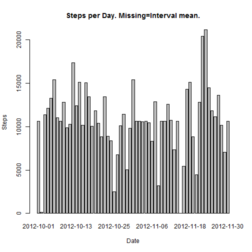

Reproducible Research: Peer Assessment 1
========================================
ASSUMPTIONS: The working directory contains the data file "activity.csv

## Load required libraries

```r
require(sqldf)
```

```
## Loading required package: sqldf
## Loading required package: gsubfn
## Loading required package: proto
## Loading required package: RSQLite
## Loading required package: DBI
## Loading required package: RSQLite.extfuns
```

```r
require(tcltk)
```

```
## Loading required package: tcltk
```

```r
require(lattice)
```

```
## Loading required package: lattice
```

```r
require(ggplot2)
```

```
## Loading required package: ggplot2
```

## Load raw data
dfRaw: dim=17568,3
       Steps:[int] Steps in Interval
     , Date:[Date] "2012-10-01".."2012-11-30"
     , Interval:[Integer] 5 minute interval 1205 means 12:05  

```r
unzip("activity.zip")
dfRaw <- read.csv("activity.csv", colClasses = c("integer", "Date", "integer"), 
    col.names = c("Steps", "Date", "Interval"))
```

## Data transformations
dfStepsByDate: dim=53,2
      Steps:[int] Average Steps per day
    , Date:[Date] dim=53,2. "2012-10-02".."2012-11-29""
Filter out rows with missing (NA) "Steps".

```r
dfStepsByDate <- sqldf("SELECT SUM(Steps) AS Steps, Date FROM dfRaw WHERE Steps IS NOT NULL GROUP BY Date;")
```

### What is mean total number of steps taken per day?
1.    Make a histogram of the total number of steps taken each day

```r
p <- tapply(dfStepsByDate$Steps, dfStepsByDate$Date, FUN = sum)
barplot(p, main = "Steps per Day", xlab = "Date", ylab = "Steps")
```

 


2.    Calculate and report the mean and median total number of steps taken per day

```r
dfSummary <- sqldf("SELECT AVG(Steps) AS MeanStepsPerDay, MEDIAN(Steps) AS MedianStepsPerDay FROM dfStepsByDate;")
summaryFormat <- "Statistics of Steps per day when ignoring rows with missing values:"
summaryFormat <- paste(summaryFormat, "Mean=%9.2f", sep = "\n")
summaryFormat <- paste(summaryFormat, "Median=%d", sep = "\n")
cat(sprintf(summaryFormat, dfSummary$MeanStepsPerDay, dfSummary$MedianStepsPerDay))
```

```
## Statistics of Steps per day when ignoring rows with missing values:
## Mean= 10766.19
## Median=10765
```

```r
# Mean=10766.19, Median=10765 about 37 per interval
```

### What is the average daily activity pattern?
1.    Make a time series plot (i.e. type = "l") of the 5-minute interval (x-axis) and the average number of steps taken, averaged across all days (y-axis)

```r
dfStepsByInterval <- sqldf("SELECT AVG(Steps) AS Steps, Interval FROM dfRaw WHERE Steps IS NOT NULL GROUP BY Interval;")  # dim=288,2
with(dfStepsByInterval, plot(Interval, Steps, main = "Steps per 5 minute Interval", 
    type = "l", xlab = "Time of Day", ylab = "Average Steps per Day"))
```

 

2.    Which 5-minute interval, on average across all the days in the dataset, contains the maximum number of steps?

```r
x <- dfStepsByInterval[dfStepsByInterval$Steps == max(dfStepsByInterval$Steps), 
    ]
# Max Steps=206 at 08:35
summaryFormat <- "The 5-minute interval=%02d:%02d has the most steps=%d"
cat(sprintf(summaryFormat, x$Interval%/%100, x$Interval%%100, x$Steps))
```

```
## The 5-minute interval=08:35 has the most steps=206
```

## Imputing missing values
1.    Calculate and report the total number of missing values in the dataset (i.e. the total number of rows with NAs)

```r
sum(is.na(dfRaw$Steps))  # Records with a missing Steps. 2304 out of 17568
```

```
## [1] 2304
```

```r
sum(!complete.cases(dfRaw))  # A more accurate method that checks all columns.
```

```
## [1] 2304
```

2.    Devise a strategy for filling in all of the missing values in the dataset. The strategy does not need to be sophisticated. For example, you could use the mean/median for that day, or <b>the mean for that 5-minute interval </b>, etc.
<br/>
Fill missing 'Steps' with the mean over all days for the corresponding 5 minute interval.
<br/>
3.    Create a new dataset that is equal to the original dataset but with the missing data filled in.

```r
dfTidy <- dfRaw

logArrMissing <- is.na(dfTidy$Steps)  # Logical array 1:17568
intArrMissingRowIndex <- which(logArrMissing)  # Integer array 1:2304
for (rowIndex in intArrMissingRowIndex) {
    Interval <- dfTidy[rowIndex, "Interval"]
    meanSteps <- dfStepsByInterval$Steps[dfStepsByInterval$Interval == Interval]
    dfTidy[rowIndex, "Steps"] <- meanSteps
}
```

4.    Make a histogram of the total number of steps taken each day and Calculate 
and report the <b>mean</b> and <b>median</b> total number of steps taken per day. 

```r
# Group Steps by Day
dfTidyStepsByDate <- sqldf("SELECT SUM(Steps) AS Steps, Date FROM dfTidy GROUP BY Date;")

p <- tapply(dfTidyStepsByDate$Steps, dfTidyStepsByDate$Date, FUN = sum)
barplot(p, main = "Steps per Day. Missing=Interval mean.", xlab = "Date", ylab = "Steps")
```

 

```r

dfSummaryMissing <- sqldf("SELECT AVG(Steps) AS MeanStepsPerDay, MEDIAN(Steps) AS MedianStepsPerDay FROM dfTidyStepsByDate;")
summaryFormatMissing <- "Statistics of Steps per day when missing values=Interval mean."
summaryFormatMissing <- paste(summaryFormatMissing, "Mean=%9.2f", sep = "\n")
summaryFormatMissing <- paste(summaryFormatMissing, "Median=%d", sep = "\n")
cat(sprintf(summaryFormatMissing, dfSummaryMissing$MeanStepsPerDay, dfSummaryMissing$MedianStepsPerDay))
```

```
## Statistics of Steps per day when missing values=Interval mean.
## Mean= 10749.77
## Median=10641
```

<b>Do these values differ from the estimates from the first part of the assignment?</b>
<p/>
There is a minor drop from 10766.19 to 10749.77 in the total daily number of steps after filling missing values. This is only an 0.2% difference.
<p/>
<b>What is the impact of imputing missing data on the estimates of the total daily number of steps?</b>
<p/>
The impact of filing missing values is minor.
<br/>

## Are there differences in activity patterns between weekdays and weekends?
1.    Create a new factor variable in the dataset with two levels "weekday" and "weekend"" 
indicating whether a given date is a weekday or weekend day.

```r
dfTidyDayType <- dfTidy
dfTidyDayType$DayType <- as.factor(ifelse((weekdays(as.Date(dfTidyDayType$Date)) %in% 
    c("Saturday", "Sunday")), "Weekend", "Weekday"))
```

2.    Make a panel plot containing a time series plot (i.e. type = "l") 
of the 5-minute interval (x-axis) and the average number of steps taken, 
averaged across all weekday days or weekend days (y-axis). 

```r
# Group Steps by Date and remove missing Steps
dfStepsByIntervalDayType <- sqldf("SELECT avg(Steps) AS Steps, DayType, Interval FROM dfTidyDayType GROUP BY DayType, Interval;")  # dim=288,2
xyplot(Steps ~ Interval | DayType, data = dfStepsByIntervalDayType, type = "l", 
    layout = c(1, 2), ylab = "Number of steps")
```

 

